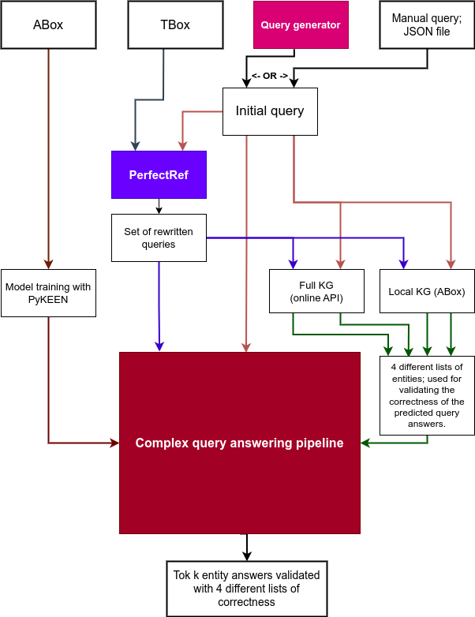

# Combining Query Rewriting with Knowledge Graph Embeddings with Complex Query Answering

## Abstract
The field of complex query answering using Knowledge Graphs (KGs) has seen substantial advancements in recent years, primarily through the utilization of Knowledge Graph Embeddings (KGEs). However, these methodologies often stumble when faced with intricate query structures that involve multiple entities and relationships. This thesis primarily investigates the potential of integrating query rewriting techniques into the KGE query answering process to improve performance in such situations. Guided by a TBox, a schema that describes the concepts and relationships in the data from Description Logics, query rewriting translates a query into a ***union of rewritten queries*** that can potentially widen the prediction scope for KGEs. The thesis uses the PerfectRef algorithm \cite{DBLP:journals/jar/CalvaneseGLLR07} for facilitating query rewriting, aiming to maximize the scope of query response and enhance prediction capabilities.

Two distinct datasets were employed in the study: The Family Dataset, a subset of Wikidata, and DBPedia15k, a subset of DBPedia. The effectiveness of the proposed methodology was evaluated against these datasets using different KGE models, in our case TransE, DistMult, BoxE, RotatE, and CompGCN. The results demonstrate a notable improvement in complex query answering when query rewriting is used for both The Family dataset and DBPedia15k. Furthermore, the amalgamation of query rewriting and KGE predictions yielded a performance boost for The Family dataset. However, the same was not observed for DBPedia15k, likely due to discrepancies and errors present within DBPedia15k compared to the Full DBPedia KG used for validation in our framework.

This research suggests that query rewriting, as a pre-processing step for KGE prediction, can enhance the performance of complex query answering, mainly when the dataset is not fully entailed. This study provides important insights into the potential and limitations of integrating query rewriting with KGEs. It may serve as a guidepost for future research to improve the complex query answering when a TBox is available.

## Pipeline

## Installation
This thesis (link will be included when published) was completed in a Conda Environment using following versions:
* Conda 		4.12.0
* Python		3.9.7
* PyTorch 		1.11.0 (py3.9_cuda11.3_cudnn8.2.0_0)
* PyKEEN 		1.9.1.dev0
* PerfectRef 	1.0.0 (https://github.com/AImenes/PerfectRef)
* owlready2 	0.36
* numpy       1.20.3
* pandas		1.3.4
* scipy		1.7.3

Thereafter, clone this repository.

## Usage of code

Run main.py.

You will be granted a menu. Your default test case environment is called 002. All the testing results will be stored in 'testcases/002' unless you change the environment using menu option 1. The environment 001 is used for my Masters Thesis.

After test environment is determined, use menu option 2 to switch between datasets.

The third option generates x amounts of queries for each query structure, and saves it in a json file in our testcase environment folder.

The forth option loads these queries into memory the framework, by inputing an x value which exists in test case environment. For instance, the x value from the one you just generated. Note, there can only be one file per length of query generation.

The fifth option trains a PyKEEN KGE model. This is optional if you already have a model.

The sixth option loads a PyKEEN KGE model.

The seventh and last option runs our query framework. PerfectRef is happening inside here automatically.
When the predictions are finished, you will find the results in the following folders:
testcases/[environment]/queries/[dataset]/
